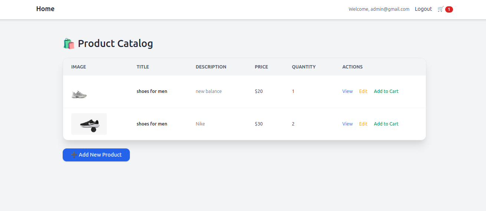

# 🛒 Symfony E-Commerce App

- Welcome to the Symfony E-Commerce App — a sleek, modern web app built with the latest Symfony & PHP versions, styled beautifully with Tailwind CSS and running seamlessly in Docker 🐳.

## 🚀 Features
### 🔐 Authentication & Authorization

 - Admins can manage the shop (add/edit/delete products).

- Regular users can browse and shop freely.

### 🛍️ Product Browsing

Users can view a list of products with clean, responsive UI.

### 🧺 Shopping Cart

Logged-in users can add products to their cart.

### ⚙️ Admin Panel

Only authenticated admins can manage product data.

### 🎨 Responsive Design

Fully mobile-friendly thanks to Tailwind CSS.

## 🧰 Tech Stack  
Here’s what powers this app:

| Technology         | Purpose                              |
|--------------------|---------------------------------------|
| 🐘 **PHP (latest)**       | Core backend language                |
| ⚙️ **Symfony (latest)**   | Main framework                      |
| 🗃️ **MySQL**              | Database                            |
| 🧠 **Doctrine**           | ORM for managing data               |
| 🧾 **Twig**               | Templating engine                   |
| 🎨 **Tailwind CSS**       | Frontend styling (responsive UI)    |
| 🐳 **Docker**             | Containerized environment           |

